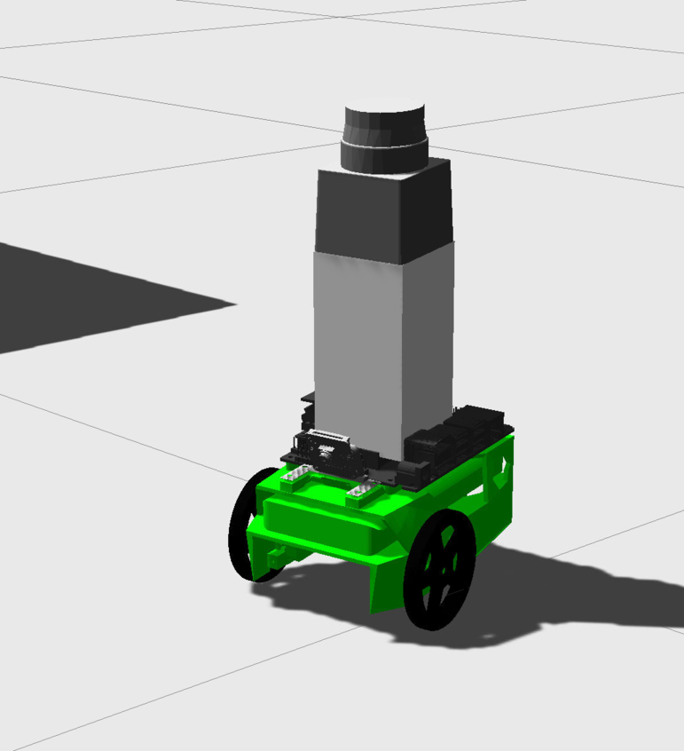

# RoboND-Home-Service-Robot
 The simulation of a full home service robot capable of navigating to pick up and deliver virtual objects [Video Clip](https://youtu.be/9t6gXnkddTM). 

[](https://youtu.be/9t6gXnkddTM)
  

## Overview  
The simulation starts by showing the marker object at the pickup zone then the Jetbot is assigned the pickup zone as the goal.
Jetbot calculates global path planning to the goal and local path planning along the way when Jetbot has arrived at the pickup zone
and then hides the marker. After that, wait 5 seconds and assign the new goal at drop off location Jetbot calculate the destination's path, then show the marker at the drop off zone once jetbot reaches it.
## Prerequisites/Dependencies  
* Gazebo >= 7.0  
* [ROS Kinetic](http://wiki.ros.org/kinetic/Installation/Ubuntu)
* ROS gazebo package
* ROS navigation package  
* ROS map-server package 
* ROS move-base package 
* ROS amcl package 
* ROS turtlebot package 
```
sudo apt-get install ros-kinetic-gazebo-ros-pkgs ros-kinetic-gazebo-ros-control  ros-kinetic-effort-controllers
sudo apt-get install ros-kinetic-navigation
sudo apt-get install ros-kinetic-map-server
sudo apt-get install ros-kinetic-move-base
sudo apt-get install ros-kinetic-amcl
sudo apt-get install ros-kinetic-turtlebot*
```


## Run the project  
* Clone ros-teleop repository
* Clone this repository
* Open the repository and make  
```
cd /home/catkin_ws/src
git clone https://github.com/ros-teleop/teleop_twist_keyboard
cd ..
catkin_make
```

* Launch my_robot in Gazebo to load both the world and plugins  
```
cd /home/workspace/catkin_ws/
source devel/setup.bash
roslaunch my_robot world.launch
```  
### Project structure:
```bash

.RoboND-Home-Service-Robot                              # Home Service Robot Project
├── README.md
├── writeup.md                                          # Project documentation
├── images                                  
│   ├── jetbot1.png
│   └── jetbot1_small.png
├── videos.  
    └── RobotND-Home-Service-Robot.gif 
└── src.                                                # ROS packages
    ├── add_makers                                      # move_base config files
    │   ├── src
    │   │   └── add_markers.cpp                         # add_makers node c++ source code
    │   ├── CMakeLists.txt                              # compiler instructions
    │   └── package.xml                                 # package info
    ├── jetbot                                          # jetbot robot package
    │   │   ├── config                                  # navigation configuration files
    │   │   │   ├── costmap_common_params.yaml          # store common local & global costmap parameters
    │   │   │   ├── dwa_local_planner_params.yaml       # store parameters of the dwa_local_planner 
    │   │   │   ├── global_costmap_params.yaml          # store common global costmap parameters 
    │   │   │   ├── global_planner_params.yaml          # store common global planner parameters
    │   │   │   ├── local_costmap_params.yaml           # store common local costmap parameters      
    │   │   │   ├── move_base_params.yaml               # store move base node parameters  
    │   │   │   └── navfn_global_planner_params.yaml    # store navfn global planner parameters      
    │   │   ├── launch                                  # jetbot launch files
    │   │   │   ├── jetbot_amcl.launch                  # map_server, amcl, move_base nodes launch file
    │   │   │   ├── jetbot_gmapping.launch              # gmapping node & parameters launch file
    │   │   │   ├── jetbot_view_navigation.launch       # rviz launch file
    │   │   │   ├── jetbot_world.launch                 # robot urdf_spawner node launch file
    │   │   │   ├── robot_description.launch            # joint_state_publisher, robot_state_publisher nodes launch file
    │   │   │   ├── teleop.launch                       # teleop_twist_keyboard node launch file
    │   │   │   └── world.launch                        # default robot urdf_spawner node launch file
    │   │   ├── maps                                    # jetbot embeded map files
    │   │   │   ├── pongrut_map.pgm                     # image map file 
    │   │   │   └── pongrut_map.yaml                    # map description file
    │   │   ├── meshes                                  # mesh files
    │   │   │   ├── hokuyo.dae
    │   │   │   ├── jetbot-chassis.dae
    │   │   │   ├── jetbot-chassis.stl
    │   │   │   ├── jetbot-chassis_no_board.stl
    │   │   │   ├── jetbot-chassis_w_caster.stl
    │   │   │   ├── jetbot-left-wheel.stl
    │   │   │   ├── jetbot-right-wheel.stl   
    │   │   │   ├── jetbot-wheel.stl
    │   │   │   ├── jetson_nano.stl
    │   │   │   └── raspbery_pi_cam.stl
    │   │   ├── rviz                                    # rviz config file for jetbot
    │   │   │   └── default.rviz  
    │   │   ├── urdf                                    # robot description files   
    │   │   │   ├── jetbot.gazebo                       # gazebo sensors plugin file  
    │   │   │   └── jetbot.xacro                        # jetbot Unified Robot Description Format (URDF) file  
    │   │   └── worlds                                  # jetbot embeded world files    
    │   │   │   ├── empty.world                           
    │   │   │   └── pongrut.world                        
    │   │   ├── CMakeLists.txt                          # compiler instructions  
    │   │   └── package.xml                             # package info
    ├── map                                             # project map files
    │   ├── pongrut_map.pgm                             # image map file 
    │   └── pongrut_map.yaml                            # map description file    
    ├── pick_objects                                    # Custom robot meshes
    │   ├── src
    │   │   └── pick_objects.cpp                        # pick_objects node c++ source code
    │   ├── CMakeLists.txt                              # compiler instructions
    │   └── package.xml                                 # package info
    ├── rvizConfig                                      # RViz config file for the project
    │   └── navigation.rviz
    ├── scripts                                         # Shell scripts
    │   ├── add_markers.sh                              # test add & remove markers script
    │   ├── home_service.sh                             # home service robot project script
    │   ├── launch.sh                                   # test gazebo, ros, and rviz launch script 
    │   ├── pick_objects.sh                             # test robot automatic goals navigation script
    │   ├── test_navigation.sh                          # test manual goal setting navigation script
    │   └── test_slam.sh                                # test manual keyboard navigation script
    ├── slam_gmapping                                   # slam_gmapping package directory
    ├── teleop_twist_keyboard                           # teleop_twist_keyboard package directory
    ├── turtlebot                                       # turtlebot keyboard_teleop package directory
    ├── turtlebot_interactions                          # turtlebot view_navigation.launch package directory   
    ├── turtlebot_simulator                             # turtlebot gazebo simluator package directory
    ├── worlds                                          # simulated world in Gazebo
    │   └── pongrut.world                               # custom world file of project
    └── CMakeLists.txt                                  # Link libraries        
```
