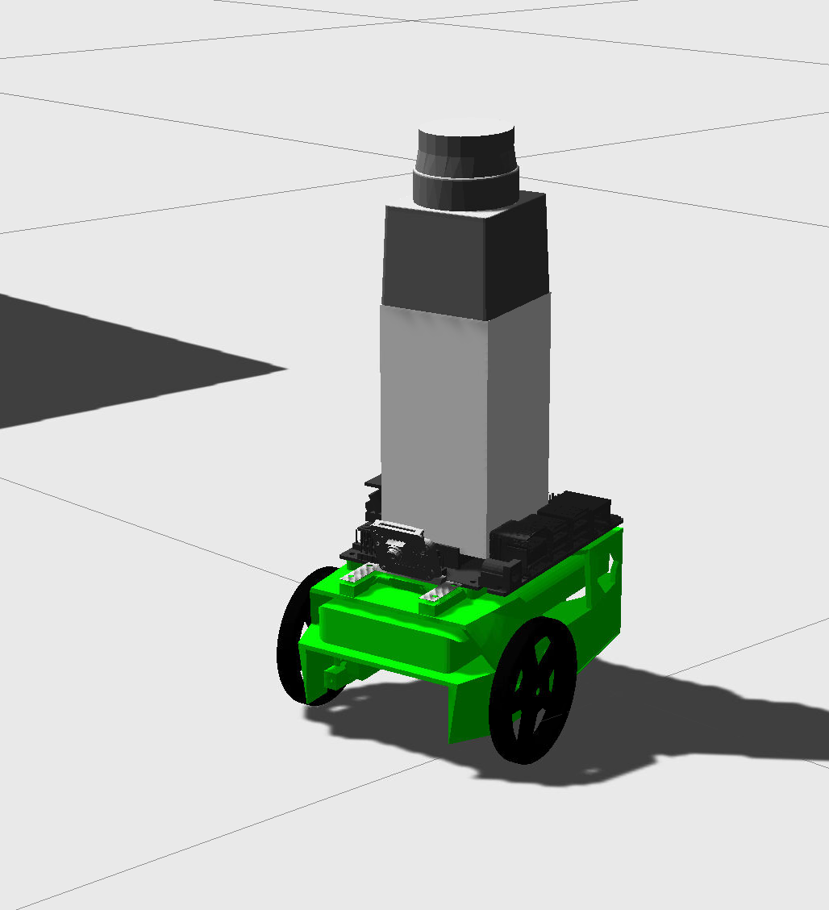

# RoboND-Home-Service-Robot
 The simulation of a full home service robot capable of navigating to pick up and deliver virtual objects. 

  
 
 
 
 
## Overview  
In this project implement ROS AMCL package to accurately localize a Jetbot inside a map in the Gazebo simulation environments.
However, Jetbot model is very small can be driven **maximum at 0.l speed**.
