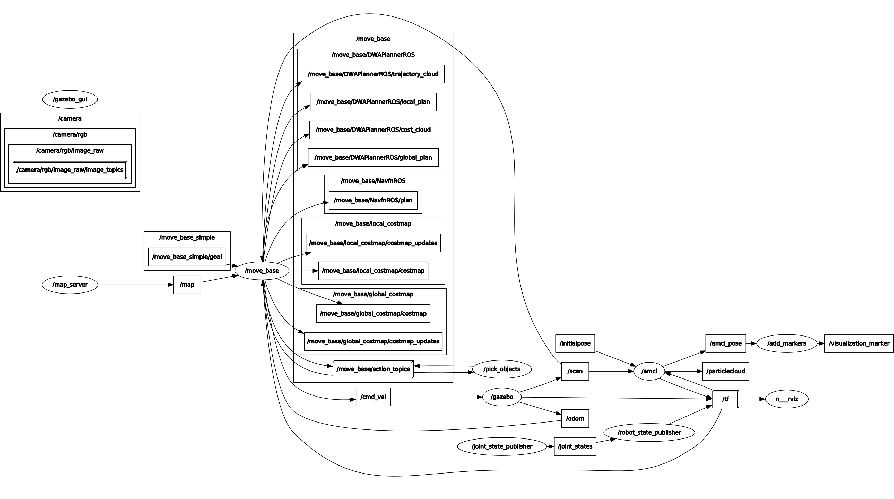

# **Home Service Robot Project** 
---

Pongrut Palarpong  
February 14, 2021

---


The goals / steps of this project are the following:

* The goal is to write software for simulating a full home service robot capable of navigating to pick up and deliver virtual objects on the ROS platform.


---
## Overview
The overview of the home service robot simulation consists of 3 main components.
1. The simulated World in gazebo simulator 3D world created in gazebo building tools as shown in Fig.1 left.
2. The simulated Robot in the gazebo develops with Unified Robot Description Format (URDF), an XML format for representing a robot model.
3. The static 2D map of the world created from manual navigation with SLAM, as shown in Fig.1 right.

There are multiple service nodes with specific functions in the background, with each service nodes communicate with each other by passing messages communicating through the central ROS Master. Gazabo Simulator will receive location and pose change information of the robot from ROS Master and be displayed in the simulation world.


Figure 1. Left:  The simulated 3D World. Middle: The simulated Robot in the gazebo. Right: 2D Map (image file with 0.0500 meter/pixel resolution, defined in pongrut_map.yaml).


## Gazebo World Simulator 
Gazebo simulator is an open-source 3D robot simulator. Gazebo integrates an ODE physics engine, OpenGL rendering, and support code for sensor simulation and actuator control. It can use the performance physics engine. Multiple high-definition options such as ODE, Bullet, etc. (default ODE) provide a realistic rendering of environments, including shadows and high-quality textures. It can simulate sensors that see a simulated environment, such as a laser rangefinder, camera. (Including wide-angle) Kinect appearance sensors, etc.


Figure 2. Custom Gazebo World of the project


## Robot in Unified Robot Description Format (URDF)
The Jetbot robot model in this project develops under URDF format. The URDF (Universal Robot Description Format) model collects files describing ROS's physical description. The URDF files are needed for ROS to understand and simulate a robot situation before building the robot. 

URDF Example
```
<!-- Ref. Creating URDF for mobile robots -->
<robot name="simple_urdf_sample">        
  <material name="grey">                 
    <color rgba="0.2 0.2 0.2 1"/>
  </material>
  <link name="link_1">                   
    <visual>                            
      <geometry>
        <box size="1 1 1"/>
      </geometry>
      <material name="grey"/>
    </visual>
    <collision>                         
      <geometry>
        <box size="1 1 1"/>
      </geometry>
    </collision>
    <inertial>                           
      <mass value="1.0"/>
      <intertia ixx="0.1" iyy="0.1" izz="0.1" ixy="0.1" ixz="0.1"/>
    </inertial>
  </link>
  </link name="link_2>                  
    <visual>
      <geometry>
        <mesh filename="mesh.stl"/>
      </geometry>
    </visual>
    <collision>
      <geometry>
        <box size="0.5 0.5 0.5"/>
      </geometry>
    </collision>
  </link>
  <joint name="joint_1" type="revolute"> 
    <origin xyz="1 0 0" rpy="0 0 0"/>
    <axis xyz="0 0 1"/>
    <parent link="link_1"/>
    <child link="link_2/>
  </joint>
</robot>
```
- **robot**: The root element contains all URDF elements inside.
- **material**: Define the color of the robot to display in Rviz.
- **link**: Define one part of the robot in URDF, robots are link defined as a combination of;
  - visual: Define how the link is displayed in. The contents are mainly the dimension, position, colors, and textures.
  - collision: Define the shape of the link for physical property calculation in 3D world simulation.
  - inertial:  Define the link inertia as a physical property calculation in 3D world simulation.
- **joint**: Defines connecting type fixed, continuous, etc., and how links and joints are connected.


Figure 3. Jetbot all joints display


## ROS TF
A robotic system has many 3D coordinate frames that change over time, such as a map frame, base frame,  wheel frames, camera frame, etc. **TF** keeps track of all these frames over time and then publish all frames related to the map, pose of the robot.  Fig.4 shows the relation of all Jetbot frames in which the robot_footprint frame is the interface base to external, but the robot's real base is base_link almost every frame link with base_link.


Figure 4. Jetbot Frames Structure (TF)


## Map
The map is an image that describes the occupancy state of each cell of the world in its corresponding pixel color. In the standard configuration, whiter pixels are blank, blacker pixels are occupied, and the pixels in between are not unknown. Color images are accepted, but the color values are averaged to grayscale. The map server work base on an image file, and it's a metadata file in yaml format.

1. pongrut_map.pgm: Picture of the map in occupancy grid representation
	- White pixels: Free cells
	- Black pixels: Occupied cells
	- Gray pixels: Unknown state
2. pongrut_map.yaml: The map metadata
	- **image**: Map name
	- **resolution**: Resolution of the map (meters/pixel)
	- **origin**: Pose of the lower-left pixel in the map (x, y, Θ)
	- **Occupied_thresh**: Cell is considered occupied if its probability is greater than this threshold.
	- **free_thresh**: Cell is considered unoccupied or free if its probability is less than this threshold.
	- **negate**: This value will check whether the notation of black colored cell=occupied and white colored cell = free should be preserved
  

 
Figure 5. Environment Map of the project

## SLAM
SLAM (Simultaneous Localization and Mapping)  is a problem creating a map of the environment while simultaneously tracking the underlying robots. It is difficult because the map is required to localize, and accurate pose estimation is required for mapping. However, there is an approximate solution using a probability algorithm such as a particle filter.
One method known as GMapping can perform SLAM on laser range data (LiDAR scanning) and local distance measurement sources. The algorithm has a ROS wrapper node in the gmapping package. Creating a map using slam_gmapping can create a 2-D occupancy grid map of the environment by feeding its node with the robot laser measurements and odometry values. The map will be updated as the robot moves and collect sensory information using its laser range finder sensor as shown in Fig.6.

Use map_saver saves a map to disk from a SLAM mapping service.
```
rosrun map_server map_saver -f pongrut_map
```


Figure 6. Environment mapping with SLAM

## AMCL
After we have a map, **amcl** package will be used to localize the robot's position in the map from the initial pose. The robot's pose may not be correct, but the robot can collect different landmarks in the map from laser range finder and odometry through sensor fusion to find the probability of the closest robot position. The implements of the Monte Carlo localization algorithm starts with the previous belief on robot location. Then, in the first loop, an odometry and laser measurement update. In the second loop, a resampling of particles occurs. Finally, the new location estimation is generated.

The amcl configuration of Jetbot initially from [amcl.launch.xml](https://github.com/turtlebot/turtlebot_apps/blob/indigo/turtlebot_navigation/launch/includes/amcl/amcl.launch.xml) file in turtlebot_navigation package. 
However, some parameters like update_min_d and update_min_a were adjusted to accommodate the small size of Jetbot [jetbot_amcl.launch](https://github.com/pongrut/RoboND-Home-Service-Robot/blob/main/src/jetbot/launch/jetbot_amcl.launch).


## Home Service Robot Navigation
The Home Service Robot consists of 3 primary components for robot simulations described earlier. The **move_base node** is a core for the navigation to which software send navigation goals and get velocity commands in return, see the diagram in Fig 7.<br/> 
However, successful robot autonomous navigation needs precise **Localization** and accurate **Path planning**.


 
Figure 7. Navigation Stack Setup
source: http://wiki.ros.org/move_base

### Localization
**move_base** node gets input data from these 3 topics for robot localization.
   1. Adaptive Monte Carlo Localization (AMCL) with **/tf** topic - A probabilistic localization system for a robot moving in 2D. 
   2. Odometry with **/odom** topic - The estimation of robot position relative to a starting location.
   3. Laser range finder with **/scan** topic - A sensor for measuring distances (ranging) around the robot by illuminating the target with laser light 360 degrees.

### Path Planning 
#### Costmaps
**move_base** node uses the costmap_2d package to generate layered 2D costmaps that are used by the planners to plan and execute a collision-free path to the navigation goal. 
- Static map layer - Represents a largely unchanging portion of the costmap, like those generated by SLAM.
- Obstacle layer - Tracks the obstacles as read by the sensor data and uses it to mark the cells as "Lethal" if it sees an obstacle and "Freespace" if the cell lies between the robot and the observed obstacle (possibly clearing cells previously marked as "Lethal").
- Inflation layer - An optimization that adds new values around lethal obstacles (i.e., inflates the obstacles) to make the costmap represent the robot's configuration space.

**move_base** node uses two costmaps to store information about the environment. One costmap is used for global planning. It means creating a long-term plan for the entire environment and the other is for local planning and obstacle avoidance.
- global_costmap − used for creating long-term plans over the entire environment from everything the robot knows from previous visits and stored knowledge.
- local_costmap − used for local planning and obstacle avoidance from everything that can be known from the current position with the sensors right now. E.g., walking people and other moving objects, as well as every wall, etc., that can be seen. It utilizes only the Obstacle and Inflation layers. It uses the "Rolling Window," meaning that it will remain centered around the robot as it moves to represent only the local surroundings. 

#### Planners
2 planners are used in **move_base** node that cooperate to accomplish navigation goals:
[move_base_params.yaml](https://github.com/pongrut/RoboND-Home-Service-Robot/blob/main/src/jetbot/config/move_base_params.yaml)
- Global Planner − operates on the global_costmap. Upon receiving a navigation goal, finds a safe path from the robot's current position to the goal position. Jetbot configuration uses the implementation from the global_planner package, which utilizes Dijkstra's algorithm. [global_planner_params.yaml](https://github.com/pongrut/RoboND-Home-Service-Robot/blob/main/src/jetbot/config/global_planner_params.yaml)
- Local Planner − operates on the local_costmap. Given a path to follow and the costmap, it produces velocity commands to send to the robot. We use the implementation from the base_local_planner package, which uses the Dynamic Window Approach (DWA). [dwa_local_planner_params.yaml](https://github.com/pongrut/RoboND-Home-Service-Robot/blob/main/src/jetbot/config/dwa_local_planner_params.yaml)


### Summary
The **add_makers** node simulates a virtual object at the pick-up zone, and the **pick_objects** node assign the first goal to pick up location by publishing goal to /move_base_simple/goal topic. The **Global Planner** will calculate the safe path for the robot. During the traveling unknown obstacle shown up in the Rolling Window, the **Local Planner** will reroute the robot's new route to move.  

In the meantime, **add_makers** node reading robot moving status from ROS Params when robot arrived at pick up zone **add_makers** node will remove the virtual object, and then **pick_objects** node assigns the second goal to the drop off zone. When the robot arrived, the drop-off zone add_makers will display the virtual object as successfully delivered, Fig 8. shows all the flow and activities of the Home Service Robot.


Figure 8. Project Active Computation Graph (click see large image):


References:<br/>
- [Gazebo: Totorial Build a world](http://gazebosim.org/tutorials?tut=build_world)<br/>
- [Building a Visual Robot Model with URDF from Scratch](http://wiki.ros.org/urdf/Tutorials/Building%20a%20Visual%20Robot%20Model%20with%20URDF%20from%20Scratch)
- [Creating URDF for mobile robots](http://translate.google.com/translate?js=n&sl=auto&tl=destination_language&u=https://gbiggs.github.io/rosjp_urdf_tutorial_text/mobile_robot_urdf.html#%E5%8F%AF%E8%A6%96%E5%8C%96%E3%82%88%E3%81%86%E3%81%AE%E3%82%B8%E3%82%AA%E3%83%A1%E3%83%88%E3%83%AA)
- [Building a Map with a Turtlebot](https://edu.gaitech.hk/turtlebot/create-map-kenict.html)
- [Adaptive Monte Carlo Localization](https://roboticsknowledgebase.com/wiki/state-estimation/adaptive-monte-carlo-localization/)
- [AMCL Parameters](http://wiki.ros.org/amcl)
- [dwa_local_planner](http://wiki.ros.org/dwa_local_planner)

- [ROS Navigation Tuning Guide](https://arxiv.org/pdf/1706.09068.pdf)

<br/>

---
