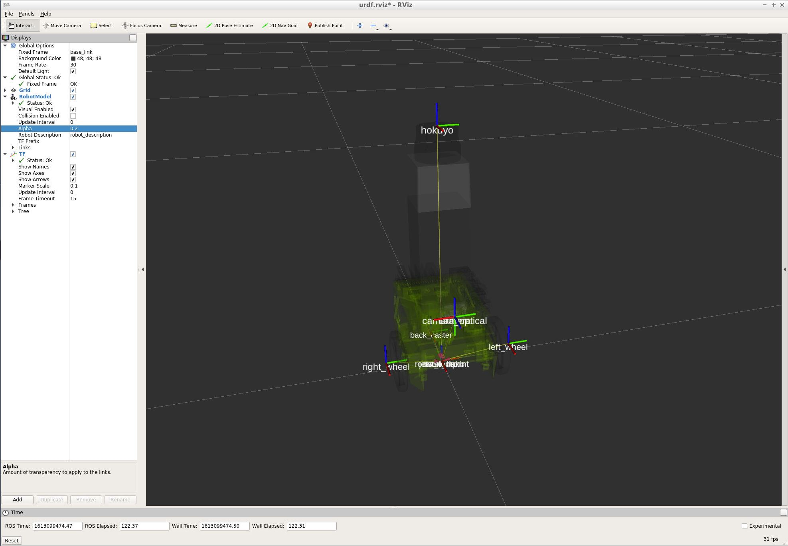

# **Home Service Robot Project** 
---

Pongrut Palarpong  
February 12, 2021

---


The goals / steps of this project are the following:

* The goal is to write software for simulating a full home service robot capable of navigating to pick up and deliver virtual objects on the ROS platform.


---
### Overview
The overview of the home service robot simulation consists of 3 main components.
1. The simulated World in gazebo simulator 3D world created in gazebo building tools as shown in Fig.1 left.
2. The simulated Robot in the gazebo develops with Unified Robot Description Format (URDF), an XML format for representing a robot model.
3. The static 2D map of the world created from manual navigation with SLAM, as shown in Fig.1 right.


There are multiple service nodes with specific functions in the background, with each service nodes communicate with each other by passing messages communicating through the central ROS Master. Gazabo Simulator will receive location and pose change information of the robot from ROS Master and be displayed in the simulation world.


Figure 1. Left:  The simulated 3D World. Middle: The simulated Robot in the gazebo. Right: 2D Map (image file with 0.0500 meter/pixel resolution, defined in pongrut_map.yaml).

### Gazebo World Simulator 
Gazebo simulator is an open-source 3D robot simulator. Gazebo integrates an ODE physics engine, OpenGL rendering, and support code for sensor simulation and actuator control. It can use the performance physics engine. Multiple high-definition options such as ODE, Bullet, etc. (default ODE) provide a realistic rendering of environments, including shadows and high-quality textures. It can simulate sensors that see a simulated environment, such as a laser rangefinder, camera. (Including wide-angle) Kinect appearance sensors, etc.


Figure 2. Custom Gazebo World of the project

### Robot in Unified Robot Description Format (URDF)
The Jetbot robot model in this project develops under URDF format. The URDF (Universal Robot Description Format) model collects files describing ROS's physical description. The URDF files are needed for ROS to understand and simulate a robot situation before building the robot. 

URDF Example
```
<!-- Ref. Creating URDF for mobile robots -->
<robot name="simple_urdf_sample">        
  <material name="grey">                 
    <color rgba="0.2 0.2 0.2 1"/>
  </material>
  <link name="link_1">                   
    <visual>                            
      <geometry>
        <box size="1 1 1"/>
      </geometry>
      <material name="grey"/>
    </visual>
    <collision>                         
      <geometry>
        <box size="1 1 1"/>
      </geometry>
    </collision>
    <inertial>                           
      <mass value="1.0"/>
      <intertia ixx="0.1" iyy="0.1" izz="0.1" ixy="0.1" ixz="0.1"/>
    </inertial>
  </link>
  </link name="link_2>                  
    <visual>
      <geometry>
        <mesh filename="mesh.stl"/>
      </geometry>
    </visual>
    <collision>
      <geometry>
        <box size="0.5 0.5 0.5"/>
      </geometry>
    </collision>
  </link>
  <joint name="joint_1" type="revolute"> 
    <origin xyz="1 0 0" rpy="0 0 0"/>
    <axis xyz="0 0 1"/>
    <parent link="link_1"/>
    <child link="link_2/>
  </joint>
</robot>
```
- **robot**: The root element contains all URDF elements inside.
- **material**: Define the color of the robot to display in Rviz.
- **link**: Define one part of the robot in URDF, robots are link defined as a combination of;
  - visual: Define how the link is displayed in. The contents are mainly the dimension, position, colors, and textures.
  - collision: Define the shape of the link for physical property calculation in 3D world simulation.
  - inertial:  Define the link inertia as a physical property calculation in 3D world simulation.
- **joint**: Defines connecting type fixed, continuous, etc., and how links and joints are connected.



Figure 3. Jetbot all joints display


### ROS TF
A robotic system has many 3D coordinate frames that change over time, such as a map frame, base frame,  wheel frames, camera frame, etc. **TF** keeps track of all these frames over time and then publish all frames related to the map, pose of the robot.  Fig.4 shows the relation of all Jetbot frames in which the robot_footprint frame is the interface base to external, but the robot's real base is base_link almost every frame link with base_link.


Figure 4. Jetbot Frames Structure (TF)

### Map
The map is an image that describes the occupancy state of each cell of the world in its corresponding pixel color. In the standard configuration, whiter pixels are blank, blacker pixels are occupied, and the pixels in between are not unknown. Color images are accepted, but the color values are averaged to grayscale. The map server work base on an image file, and it's a metadata file in yaml format.

1. pongrut_map.pgm: Picture of the map in occupancy grid representation
	- White pixels: Free cells
	- Black pixels: Occupied cells
	- Gray pixels: Unknown state
2. pongrut_map.yaml: The map metadata
	- **image**: Map name
	- **resolution**: Resolution of the map (meters/pixel)
	- **origin**: Pose of the lower-left pixel in the map (x, y, Θ)
	- **Occupied_thresh**: Cell is considered occupied if its probability is greater than this threshold.
	- **free_thresh**: Cell is considered unoccupied or free if its probability is less than this threshold.
	- **negate**: This value will check whether the notation of black colored cell=occupied and white colored cell = free should be preserved
  

 
Figure 5. Environment Map of the project


Creating a map using slam_gmapping can create a 2-D occupancy grid map of the environment by feeding its node with the robot laser measurements and odometry values. The map will be updated as the robot moves and collect sensory information using its laser range finder sensor as shown in Fig.6.


Figure 6. Environment mapping with SLAM


References:<br/>
- [Gazebo: Totorial Build a world](http://gazebosim.org/tutorials?tut=build_world)<br/>
- [Building a Visual Robot Model with URDF from Scratch](http://wiki.ros.org/urdf/Tutorials/Building%20a%20Visual%20Robot%20Model%20with%20URDF%20from%20Scratch)
- [Creating URDF for mobile robots](http://translate.google.com/translate?js=n&sl=auto&tl=destination_language&u=https://gbiggs.github.io/rosjp_urdf_tutorial_text/mobile_robot_urdf.html#%E5%8F%AF%E8%A6%96%E5%8C%96%E3%82%88%E3%81%86%E3%81%AE%E3%82%B8%E3%82%AA%E3%83%A1%E3%83%88%E3%83%AA)

<br/>

---

### Discussion

#### 1. Briefly discuss any problems / issues you faced in your implementation of this project.  Where will your pipeline likely fail?  What could you do to make it more robust?

In this project, I used the Yolov1 model for the Vehicle Detection. YOLO can define the bounding box is more robust than HOG & SVM. However, in some situation pre-trained models confuse in predicting object class such as car and truck, especially a small object image. 

In high accuracy classify case, it may require using the more accurate model such as YOLOv3, including the use of image segmentation and image upscaling techniques before detection.

